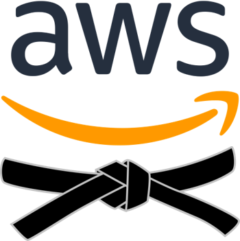
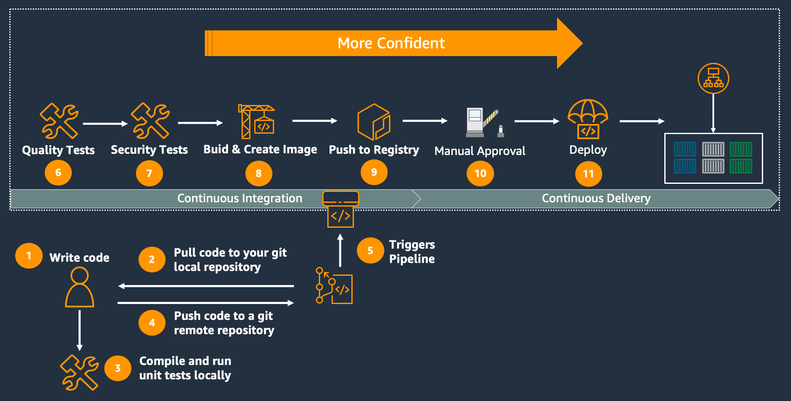
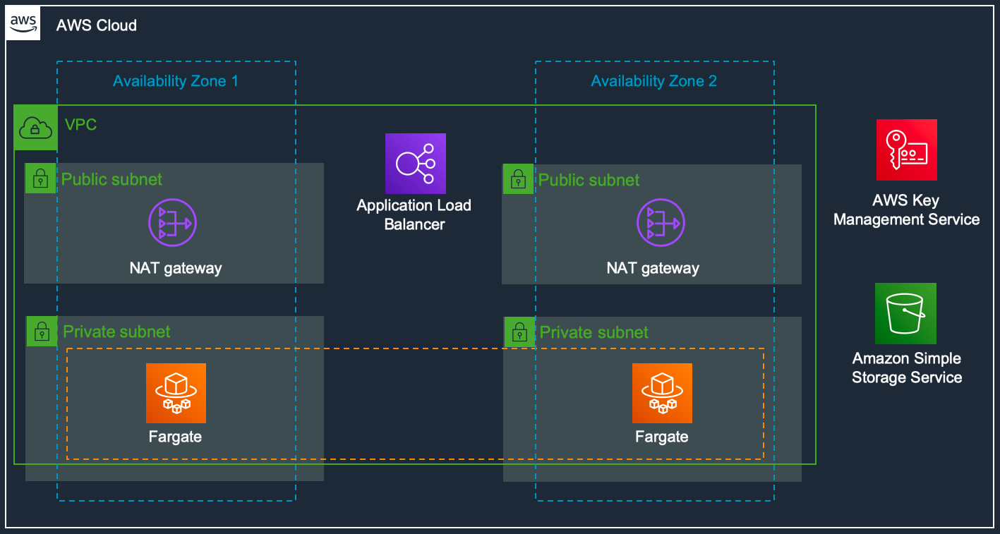
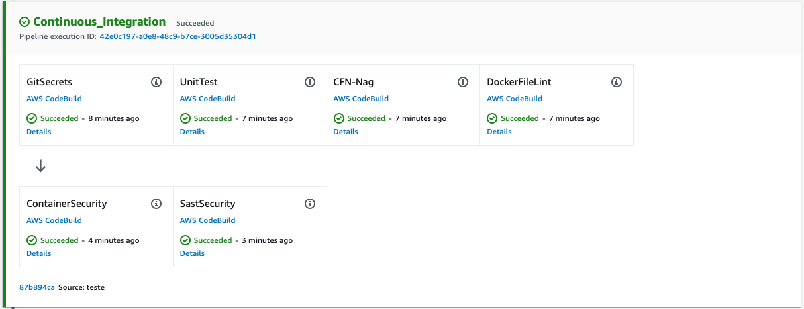

# AWS BlackBelt | *Application Modernization*



# Workshop AWS DevTools

## Visão Geral
Implemente pipelines CI/CD para micro-serviços em python rodando em container no Fargate.




### Stack

* **Linguagem:** Python
* **Repositório:** CodeCommit
* **Pipeline:** CodePipeline + CodeBuild + CodeDeploy
* **Recurso computacional:** ECS Fargate




### Testes aplicados na pipeline:



* ***Git Secrets***
    * [Git Secrets](https://github.com/awslabs/git-secrets)
* ***Unit Test & Test Coverage***
    * [Unit testing framework](https://docs.python.org/3/library/unittest.html)
    * [Coverage.py](https://coverage.readthedocs.io/en/coverage-5.2.1/)
* ***Lint para Cloudformation***
    * [CFN_Nag](https://github.com/stelligent/cfn_nag)
* ***Lint para Dockerfile***
    * [Haskell Dockerfile Linter](https://github.com/hadolint/hadolint)
* ***SAST***
    * [OWASP Dependency Check](https://pypi.org/project/dependency-check/)
    * [Safety](https://github.com/pyupio/safety)
    * [Bandit](https://github.com/PyCQA/bandit)
* ***Container Security***
    * [Trivy](https://github.com/aquasecurity/trivy)

<br />

## Tópicos:

#### [1. Preparação do ambiente para o workshop](https://github.com/hgbueno/devtools-workshop#1-preparação-do-ambiente-para-o-workshop)
#### [2. Criação das stacks de fundação](https://github.com/hgbueno/devtools-workshop#2-criação-das-stacks-de-fundação)
#### [3. Criação do primeiro micro-serviço](https://github.com/hgbueno/devtools-workshop#3-criação-o-primeiro-micro-serviço)
#### [4. Criação de pipelines para novas branches](https://github.com/hgbueno/devtools-workshop#4-criação-de-pipelines-para-novas-branches)
#### [5. Adicionando testes na pipeline](https://github.com/hgbueno/devtools-workshop#5-adicionando-estágios-de-testes-na-pipeline)

<br />
<br />

## 1. Preparação do ambiente para o workshop

### 1.1 Valide o acesso à sua conta no Event Engine através da console.
> *informações enviadas por e-mail*
> * [Event Engine](https://dashboard.eventengine.run/login)

### 1.2 Caso ainda não tenha, instale a ***aws cli***
> * [Como instalar a aws cli](https://docs.aws.amazon.com/pt_br/cli/latest/userguide/install-cliv2.html)

### 1.3 Crie um novo profile para a sua conta.
* Você deve pegar suas credenciais na console do **Event Engine**, na opção ***AWS Console***
* Exemplo de configuração do arquivo ~/.aws/credentials
> Importante configurar o parâmetro aws_session_token!
```
[myprofile]
aws_access_key_id = <your_access_key>
aws_secret_access_key = <your_secret_key>
aws_session_token = <your_token>
```
> * [Como configurar um novo profile](https://docs.aws.amazon.com/cli/latest/userguide/cli-configure-files.html)


### 1.4 Valide a configuração do seu profile.
O comando abaixo deverá retornar seu **AccountId**:
```
aws sts get-caller-identity --query Account --output text --profile <profile>
```

### 1.5 Crie seu usuário para o CodeCommit.
* Na [Console do IAM](https://console.aws.amazon.com/iam/home?region=us-east-1), crie um novo usuário com acesso do tipo ***Programmatic access*** (sem acesso à console), crie um grupo chamado ***CodeCommitUsers*** e selecione a managed policy ***AWSCodeCommitPowerUser***.
* Crie uma nova credencial HTTPS para o CodeCommit para este novo usuário.

> * [Criação de um usuário do IAM na sua conta da AWS](https://docs.aws.amazon.com/pt_br/IAM/latest/UserGuide/id_users_create.html#id_users_create_console)
> * [Configuração para usuários de HTTPS usando credenciais do Git](https://docs.aws.amazon.com/pt_br/codecommit/latest/userguide/setting-up-gc.html)


### 1.5 Confirme que a nova credencial está funcionando.
* Na [Console do CodeCommit](https://console.aws.amazon.com/codesuite/codecommit/home?region=us-east-1#), crie um repositório apenas para teste.
* Clone o repositório em sua máquina utilizando a nova credencial.
* Para copiar a URL do novo repositório, clique em **Clone URL**, depois em **Clone HTTPS**.
* Na sua máquina, execute:
```
git clone <RepoURL>
```
* Delete o repositório.

> [Conceitos básicos do Git e do AWS CodeCommit](https://docs.aws.amazon.com/pt_br/codecommit/latest/userguide/getting-started.html#getting-started-create-repo)


### 1.6 Clone este repositório.
```
git clone https://github.com/hgbueno/devtools-workshop.git
```
<br />
<br />
<br />

## 2. Criação das stacks de fundação
> Seguindo a boa prática para segmentar stacks em camadas, criaremos 3 stacks:
> * **1. Netwoking:** Toda a infraestrutura de VPC e conectividade em multi-az(2), incluindo o Application Load Balancer.
> * **2. Common:** Recursos que serão compartilhados entre todas os micro-serviços que criaremos. KMS e S3 Bucket.
> * **3. Fargate:** Cluster Fargate.
>
> [Melhores práticas do AWS CloudFormation](https://docs.aws.amazon.com/pt_br/AWSCloudFormation/latest/UserGuide/best-practices.html)

***ATENÇÃO! Existem dependências entre as stacks, portanto elas não podem ser criadas paralelamente.***

### 2.1 Networking
```
 aws cloudformation deploy \
    --stack-name networking \
    --template-file foundation/networking.yaml \
    --capabilities CAPABILITY_IAM \
    --region <region> \
    --profile <profile>
```

### 2.2 Commons
```
aws cloudformation deploy \
    --stack-name commons \
    --template-file foundation/commons.yaml \
    --capabilities CAPABILITY_IAM \
    --region <region> \
    --profile <profile>
```

### 2.3 Fargate
```
aws cloudformation deploy \
    --stack-name fargate \
    --template-file foundation/fargate.yaml \
    --capabilities CAPABILITY_IAM \
    --region <region> \
    --profile <profile>
```
<br />
<br />
<br />

## 3. Criação o primeiro micro-serviço


### 3.1 Crie a stack para o micro-serviço
Na [Console do Cloudformation](https://console.aws.amazon.com/cloudformation/home?region=us-east-1#), crie uma nova stack com base no template **pipeline.yaml** com os seguintes parâmetros:
* **Stack name:** pipeline-myapp
* **ServiceName:** myapp
* **Email:** <seu_email>
> *Não é necessário alterar os valores dos demais parâmetros.*

* **ATENÇÃO! Você receberá um e-mail para confirmar a inscrição no tópico SNS. Faça essa confirmação antes de prosseguir.**
* Verifique que o repositório foi criado no CodeCommit.
* Verifique que a pipeline foi criada no CodePipeline.


### 3.2 Clone o novo repositório e copie os arquivos da aplicação.

#### Clone o repositório

* Acesse a [Console do CodeCommit](https://console.aws.amazon.com/codesuite/codecommit/home?region=us-east-1#), clique em **Clone URL**, depois em **Clone HTTPS**.
* Na sua máquina, execute:
```
git clone <RepoURL>
```

* Copie o conteúdo do diretório sample-app do repositório do workshop para o novo repositório do CodeCommit. Exemplo:
```
cp -rpf ../devtools-workshop/sample-app/* <RepoName>/
```

### 3.3 Configure os parâmetros para o micro-serviço
> ATENÇÃO NESTE PASSO!
* templates/service.yaml
    * **ServiceName:** myapp
    * **ServicePath:** /myapp
    * **BranchName:** master
    * **AlbRulePriority:** 2 (AlbRulePriority+1) ***Este número nunca deve ser repetido entre os micro-serviços***

* app/main.py
    *  **mypath="myapp"**

### 3.4 Envie o código para repositório
```
git add .
git commit -m "first commit"
git push origin master
```

### 3.5 Acompanhe a execução da pipeline
* Acesse a [Console do CodePipeline](https://console.aws.amazon.com/codesuite/codepipeline/pipelines?region=us-east-1)
* Acompanhe os logs de execução de cada job do CodeBuild.
* Valide que os relatórios de execução estão sendo salvos no Bucket S3
* Após o estágio de Publish, você receberá um e-mail solicitando aprovação para seguir com a pipeline.
* Acesse a URL do Load Balancer adicionando o path do seu microserviço para vê-lo funcionando.
    * Para pegar a URL do Load Balancer, vá até a Console do Cloudformation, acesse a stack **networking** e clique em Outputs.
    * Ao final da URL, adicione "***/myapp***".
    * ***Obs: Este passo somente funcionará após iniciar o deploy do serviço. (penúltimo estágio da pipeline).***
* Atualize (refresh) algumas vezes a página para conferir que as conexões estão sendo balanceadas entre as duas AZ's.
    * ***Obs: Este passo somente funcionará após iniciar o deploy do serviço. (penúltimo estágio da pipeline).***

<br />
<br />
<br />


## 4. Criação de pipelines para novas branches

### 4.1 Crie uma nova branch
```
git checkout -b develop
```

### 4.2 Edite os seguintes arquivos para o novo micro-serviço:
> ATENÇÃO NESTE PASSO!
* templates/service.yaml
    * **ServiceName:** myapp ***(este parâmetro não muda!)***
    * **ServicePath:** /myapp-develop ***(este é o path que será usado no ALB para o novo micro-serviço)***
    * **BranchName:** develop
    * **AlbRulePriority:** 3 (AlbRulePriority+1) ***ATENÇÃO! Este número nunca deve ser repetido entre os micro-serviços***

* app/main.py
    *  **mypath="myapp-develop"**

### 4.3 Envie as mudanças para repositório
```
git add .
git commit -m "first commit"
git push origin develop
```

### 4.4 Crie uma nova pipeline para a branch develop
Na [Console do Cloudformation](https://console.aws.amazon.com/cloudformation/home?region=us-east-1#), crie uma nova stack com base no template **pipeline.yaml** com os seguintes parâmetros:
* **Stack name:** pipeline-myapp-develop
* **ServiceName:** myapp ***(mesmo nome do serviço criado anteriormente)***
* **BranchName:** develop
* **Email:** seu@email.com
* **ManualApproval:** false
> *Não é necessário alterar os valores dos demais parâmetros.*

* Verifique que a pipeline foi criada no CodePipeline.
> Não será criado um novo repositório como da primeira vez porque existe uma ***condition*** no Cloudformation para apenas criar o repositório quando a branch informada for a ***master***.

### 4.5 Valide a execução da pipeline
* Acesse a URL do Load Balancer adicionando o path do seu microserviço para vê-lo funcionando.
    * Para pegar a URL do Load Balancer, vá até a Console do Cloudformation, acesse a stack **networking** e clique em Outputs.
    * Ao final da URL, adicione "***/myapp-develop***".
    * ***Obs: Este passo somente funcionará após iniciar o deploy do serviço. (penúltimo estágio da pipeline).***
* Atualize (refresh) algumas vezes a página para conferir que as conexões estão sendo balanceadas entre as duas AZ's.
    * ***Obs: Este passo somente funcionará após iniciar o deploy do serviço. (penúltimo estágio da pipeline).***

<br />
<br />
<br />


## 5. Adicionando estágios de testes na pipeline

### 5.1 Edite a pipeline master
* Na [Console do Cloudformation](https://console.aws.amazon.com/cloudformation/home?region=us-east-1#), edite a stack da pipeline master ***(pipeline-myapp)***, selecionando a opção ***Use current template***.
* Habilite os demais testes que estavam desabilitados.
* Após concluir a atualização, vá até a pipeline no console do CodePipeline e clique em ***Release Changes***.

<br />
<br />


## Conteúdo adicional
* [Multi-branch CodePipeline strategy with event-driven architecture](https://aws.amazon.com/blogs/devops/multi-branch-codepipeline-strategy-with-event-driven-architecture/)


## Workshops relacionados
* [Adding Security into DevOps](https://devops.awssecworkshops.com)
* [Integrating security into your container pipeline](https://container-devsecops.awssecworkshops.com)
* [Amazon ECS Workshop for AWS Fargate](https://ecsworkshop.com)
* [Amazon EKS Workshop](https://www.eksworkshop.com)
* [Build a Modern Application on AWS](https://github.com/aws-samples/aws-modern-application-workshop)
* [CDK Workshop](https://cdkworkshop.com)
* [AWS App Mesh Workshop](https://www.appmeshworkshop.com)
* [Amazon CodeGuru](https://awsdemoworkshops.s3.us-east-2.amazonaws.com/codeguru/public/en/index.html)
* [CI/CD with Fargate](https://awsdemoworkshops.s3.us-east-2.amazonaws.com/cicd-fargate-bg-workshop/public/en/index.html)
* [CI/CD for Serverless Applications](https://cicd.serverlessworkshops.io)